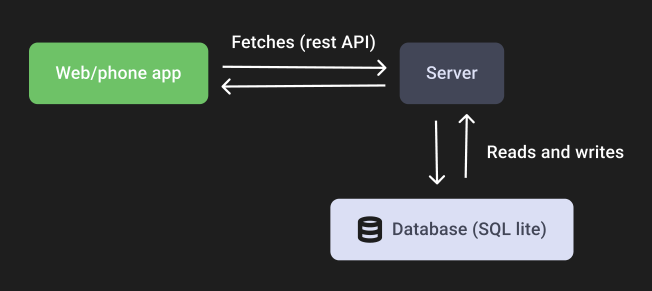

# Getting started

Welcome! Before you can start using Skapersøk, you need to understand a little bit about how it works. Don't worry, we handle the hard stuff for you, but it is good to know some things about what is going on behind the scenes.

## Architecture
Skapersøk consists of two main components:

1. The frontend app
2. The backend server

**The frontend** is what you use to view, search and manage your inventory.

**The backend** is what stores the data and makes it available to the frontend.

If you are just trying to search in someones existing inventory, you only need to use the app. Go to the [App setup](app_setup.md) section for more information.

If you want to set up your own inventory system, you will need to first set up the backend server. Go to the
[Server setup](server_setup.md) section for more information.