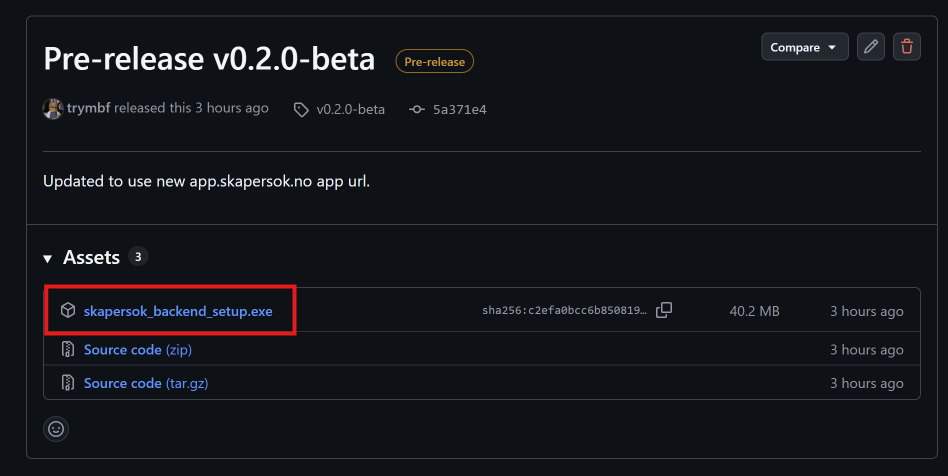
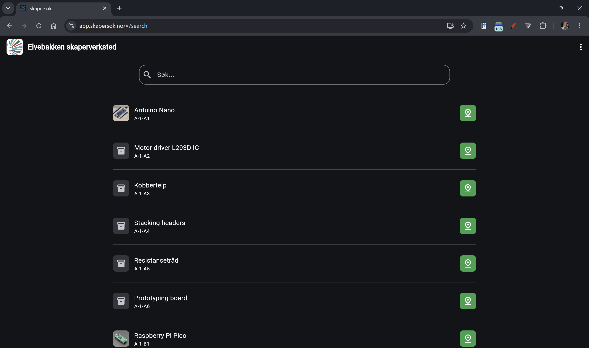
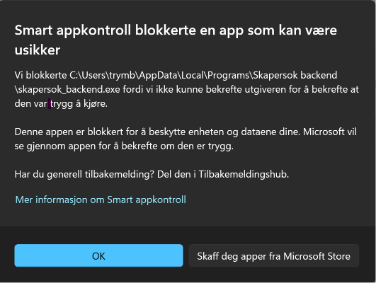
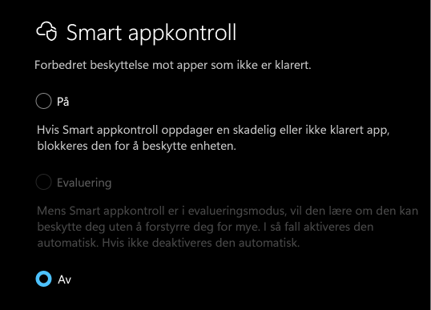

# Server Setup
Want to set up your own Skapersøk server? This guide will walk you through the process of doing just that.

There are three ways of getting the server up and running.

1. [Using the installer (Windows only)](#using-the-installer-windows-only)
2. [Using Python (all platforms)](#using-python-all-platforms)
3. [Using Docker (all platforms)](#using-docker-all-platforms)

## Using the Installer (Windows only)

Download the latest installer from the [releases page](https://github.com/Skapersok/skapersok_backend/releases).



Run the installer and follow the instructions.

After starting the server, the web app should automaticaly open and connect.



You should also see a terminal window showing information about the server.


**You can stop the server by closing the terminal window or pressing Ctrl+C in the terminal.**

## Using Python (all platforms)

### 1. Prerequisites

- Python
- [uv](https://docs.astral.sh/uv/) (recommended) or plain `pip`

### 2. Install dependencies

With `uv` (recommended — also creates the virtual environment for you):

```bash
uv sync
```

With plain `pip`:

```bash
python3 -m venv .venv
source .venv/bin/activate      # Windows: .venv\Scripts\Activate
pip install --upgrade pip
pip install .
```

### 3. Configuration

While the server runs fine out of the box, review `config/.env` and set values explicitly rather than relying on defaults.

### 4. Start the server

```bash
uv run python main.py
```

or, with plain pip and an activated venv:

```bash
python main.py
```

This runs startup checks (folder creation, config bootstrap), starts the discovery beacon, and launches the API. By default it also opens your browser to the running instance — set `AUTOOPEN_BROWSER=false` in `config/.env` to disable this.

### 5. Verify the server is up and running

```bash
curl http://127.0.0.1:5000/ping
```

Expected response:

```json
{"message": "pong"}
```

## Using Docker (all platforms)

**Note!** Opening the browser automatically is disabled by default when using docker.

### 1. Prerequisites

- Docker and Docker Compose installed
- Linux host recommended (see note on the discovery beacon below)

### 2. Clone the repository

```bash
git clone https://github.com/Skapersok/skapersok_backend
cd skapersok-backend
```

### 3. Start the server

On **Linux**:

```bash
docker compose up -d
```

On **Windows**:

```bash
docker compose -f docker-compose.yml -f docker-compose.windows.yml up -d
```

This builds the image, creates the necessary folders and starts the server.

Check it's healthy:

```bash
docker compose ps
curl http://localhost:5000/ping
```

### 4. Set a few things before going to production

While the server runs fine out of the box, review `config/.env` and set values explicitly rather than relying on defaults.

### 5. Updating

```bash
git pull
docker compose build
docker compose up -d
```

Editing `config/.env` only (no code change) just needs:

```bash
docker compose up -d
```

No rebuild required — config changes take effect on container restart.

### Which data persists across restarts and rebuilds

- `./data` — databases, images, backups
- `./config` — `.env` settings, IDs and secrets

Both are bind-mounted from the host, so `docker compose down` and even `docker compose build` will not touch them. Only deleting these folders yourself will reset the app to a fresh state.

## FAQ

### 1. The backend is getting blocked by smart screen (Windows)


If you are on **Windows**, you may get a warning from SmartScreen when trying to run the installer. This is because the installer is at the moment is **not signed with a certificate**, this is being worked on. You can safely ignore this warning and click "Run anyway" to continue with the installation. ALl the source code is available on GitHub, so you can also build the installer yourself if you want to be sure that it is safe to run.

You can also **disable SmartScreen** temporarily, but this is **not recommended** to do for an extended period as it will make your computer more vulnerable to malware.
