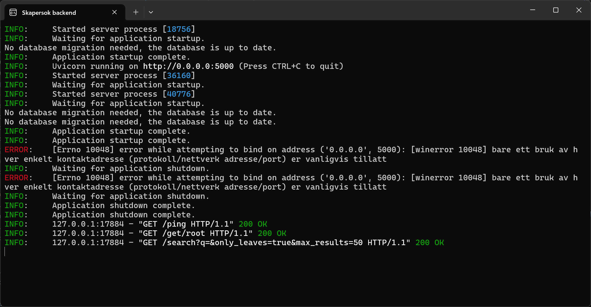

# Server Setup
Want to set up your own Skapersøk server? This guide will walk you through the process of doing just that.

=== "Windows (recommended)"
    Download the latest installer from the [releases page](https://github.com/Skapersok/skapersok_backend/releases).

    

    Run the installer and follow the instructions.

    After starting the server, the web app should automaticaly open and connect.

    

    You should also see a terminal window showing information about the server.

    
    **You can stop the server by closing the terminal window or pressing Ctrl+C in the terminal.**

=== "Linux, Mac and developer"

    See the readme in the [backend repository](https://github.com/Skapersok/skapersok_backend) for instructions on how to set up the server manually.

## FAQ
### 1. The backend is getting blocked by smart screen (Windows)

If you are on **Windows**, you may get a warning from SmartScreen when trying to run the installer. This is because the installer is at the moment is **not signed with a certificate**, this is being worked on. You can safely ignore this warning and click "Run anyway" to continue with the installation. ALl the source code is available on GitHub, so you can also build the installer yourself if you want to be sure that it is safe to run.

You can also **disable SmartScreen** temporarily, but this is **not recommended** to do for an extended period as it will make your computer more vulnerable to malware.
