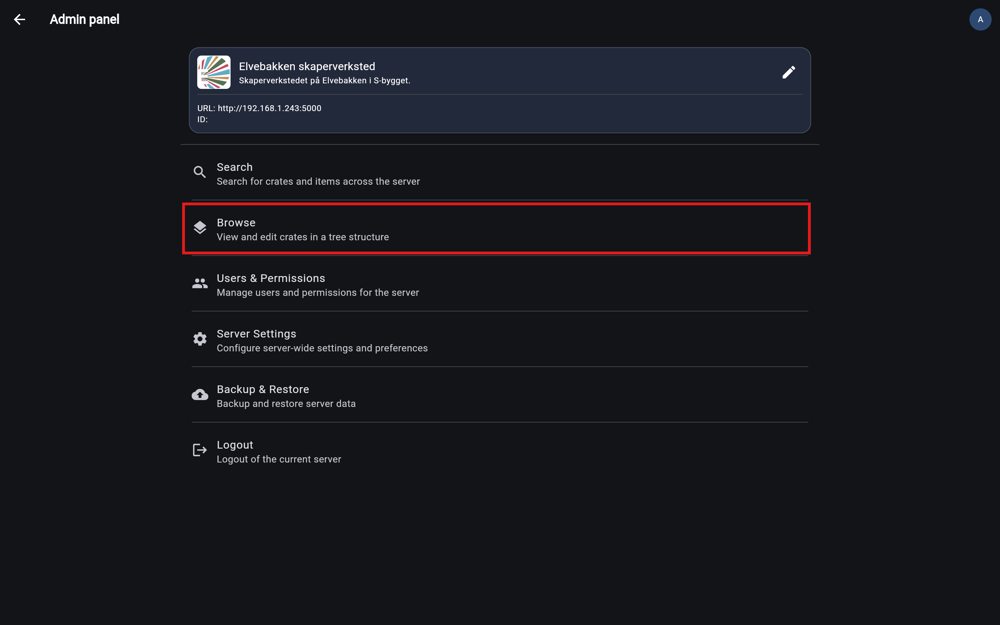
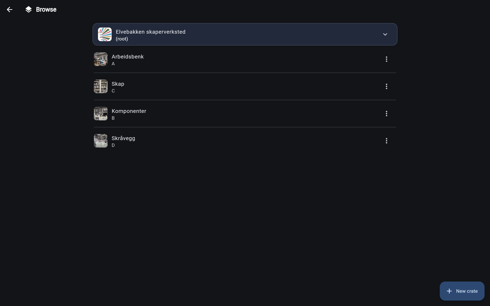
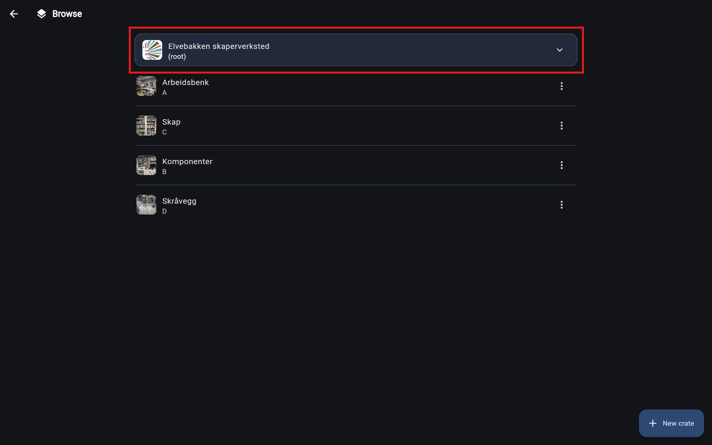
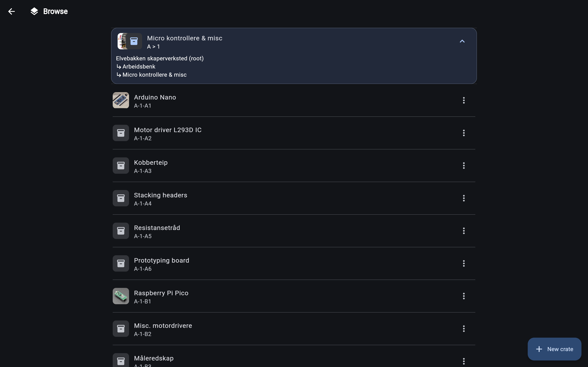
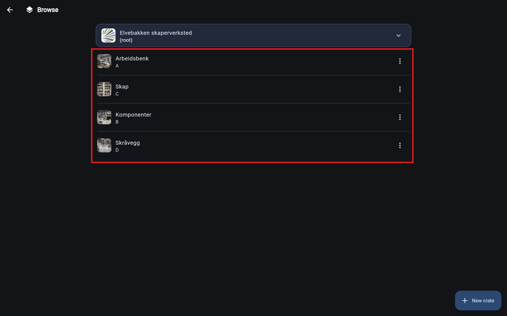

# The browse page
Skapersøk is a hirarchical inventory system, meaning that your inventory is structured in a tree-like structure.

The browse page allows you to navigate through this structure like a file explorer.

The browse page is also the only page where you can **create new crates**.

## Getting there
To get to the browse page, click the "Browse" button in the [admin-panel](admin_panel.md).

## Getting familiar with it
Welcome to the browse page! Here you can:

- navigate through your inventory
- create new crates
- edit existing crates
- delete crates
- generate labels

Lets get a little more familiar with the browse page.

Centered on the top is a section with information about our current location in the inventory. The location is represented as a path, similar to how file paths are represented on your computer.

Here is an example of the browse page when we have navigated deeper into the inventory. The path section now shows us that we are currently inside a crate called "Micro kontrollere & misc", which is inside another crate called "Arbeidsbenk".

The other important part of the browse page is the list of items. This is where you can see all the items that are in your current location in the inventory. Meaning all items in your currently selected crate.

For example, in the above image we can see that there are four crates at the top of our tree (the root): "Arbeidsbenk", "Skap", "Komponenter" and "Skråvegg".

## Now what?
There is a lot to do in the browse page, so we have created a separate guide for each action:

- [Creating a new crate](../usage/create_crate.md)
- [Editing an existing crate](../usage/edit_crate.md)
- [Deleting a crate](../usage/delete_crate.md)
- [Generating labels](../usage/generate_labels.md)