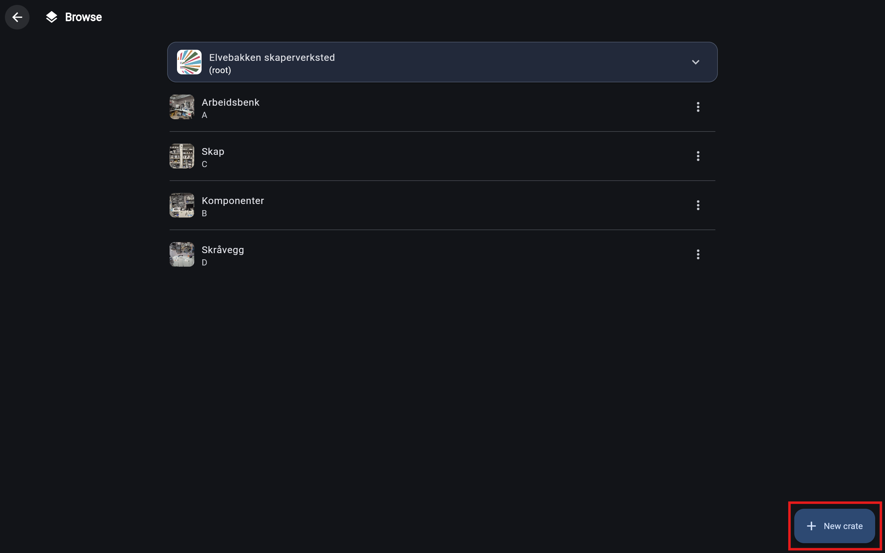

# Creating a new crate
Creating a new crate is easy and you can create a new one anywhere in your inventory.

## Setup and info
Start by navigating to the [browse page](../interfaces/browse_page.md).

When creating a crate, your current place in the inventory, will be used as the location for the new crate.

Meaning that if I for example want to add a new crate inside of "Arbeidsbenk", I would need to first click on the arbeidsbenk element to navigate inside, before clicking the "New crate" button.

For this demonstration, we will just create a new crate in the root of our inventory.

## Now we create

Click the "New crate" button in the bottom right corner.

This will open the crate creation wizard.

### Step 1: Selecting purpose of crate
There are no different types of crates in Skapersøk, they all share the same properties and functionality. This is one of the biggest advantages of the system. But, to ease 