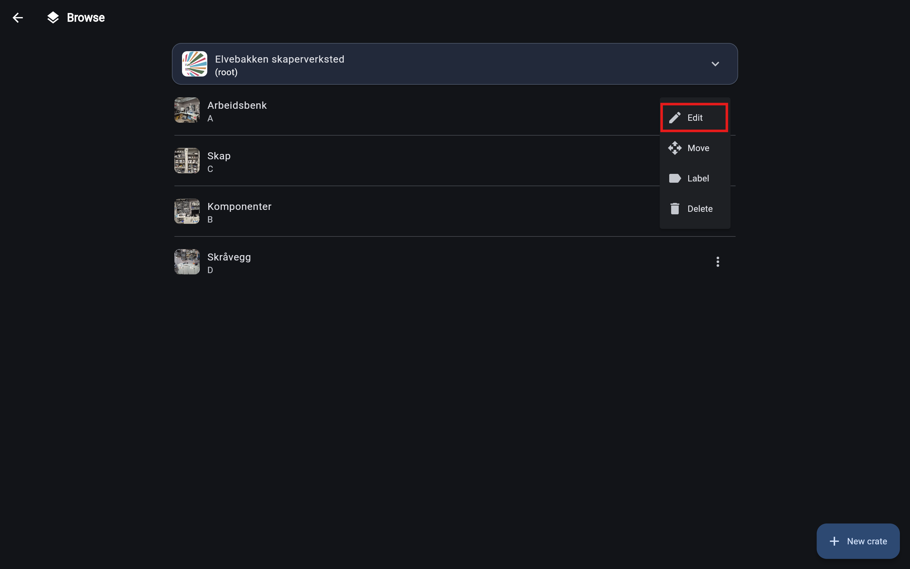
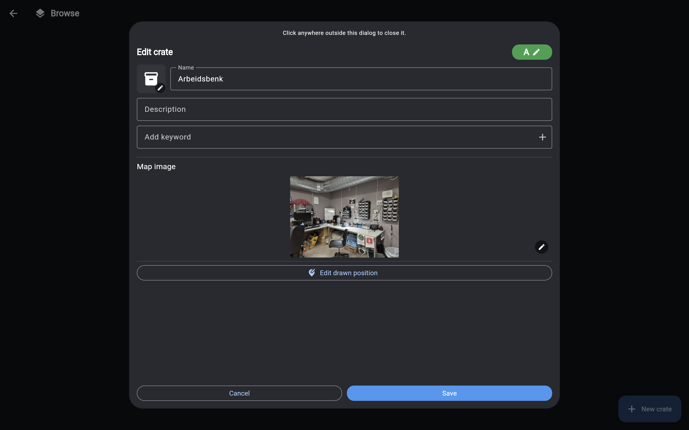

# Editing a crate

You can edit any existing crate in your inventory.

Don't have any crates yet? Check out the [Creating a new crate](../usage/create_crate.md) guide to learn how to create your first one.

## Lets go
Start by navigating to the [browse page](../interfaces/browse_page.md) and finding the crate you want to edit. You can use the path section at the top of the browse page to navigate through your inventory.

To edit the crate, click the three dots on the right side of the crate you want to edit. This will open a dropdown with options for that crate.

Select "Edit" from the dropdown to open the edit form for that crate. On mobile this will open a bottom sheet with the edit form, while on desktop it will open a modal window with the edit form.

Now you can edit the name, placementcode, description and lots of other properties of the crate. When you are done, click the "Save" button to save your changes.

