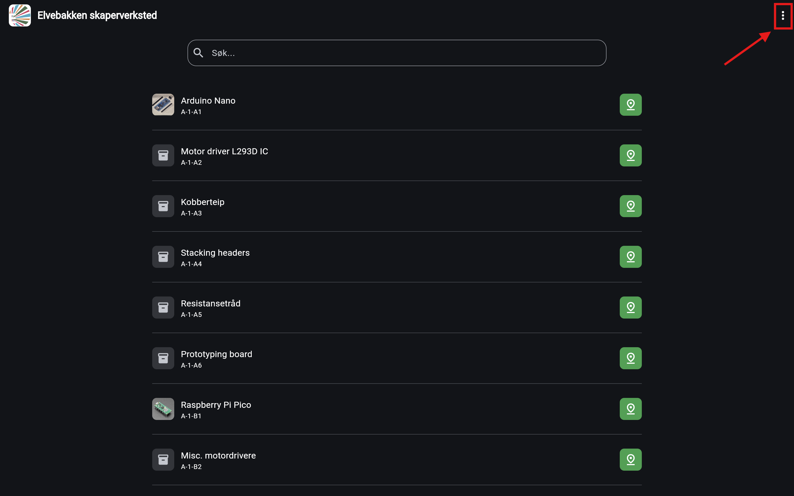
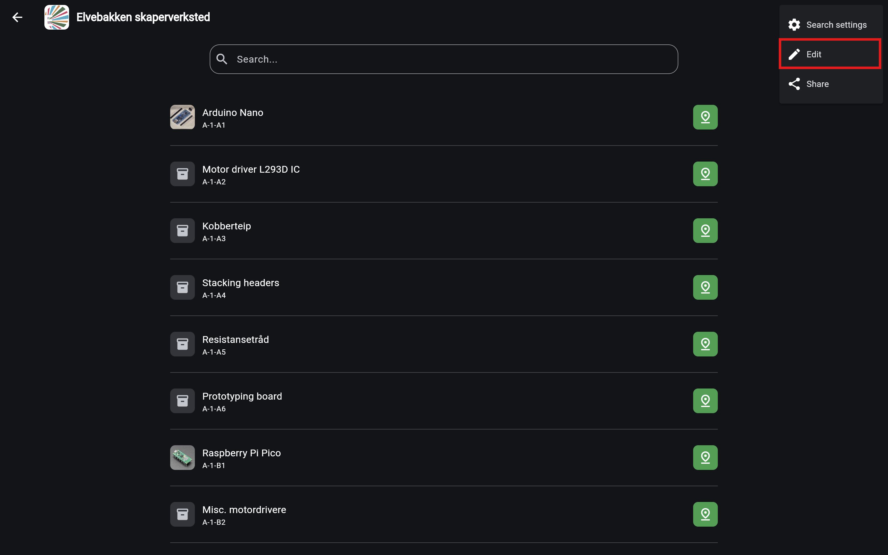
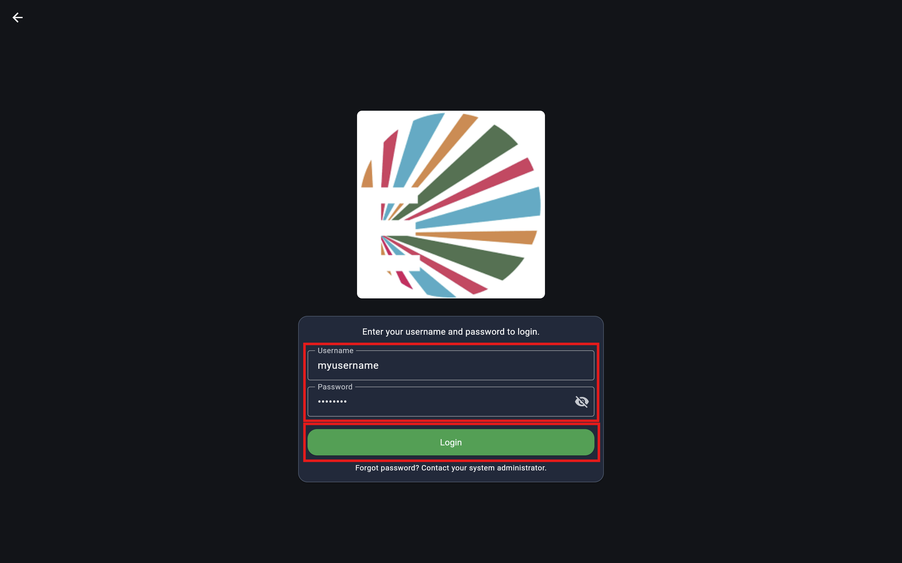
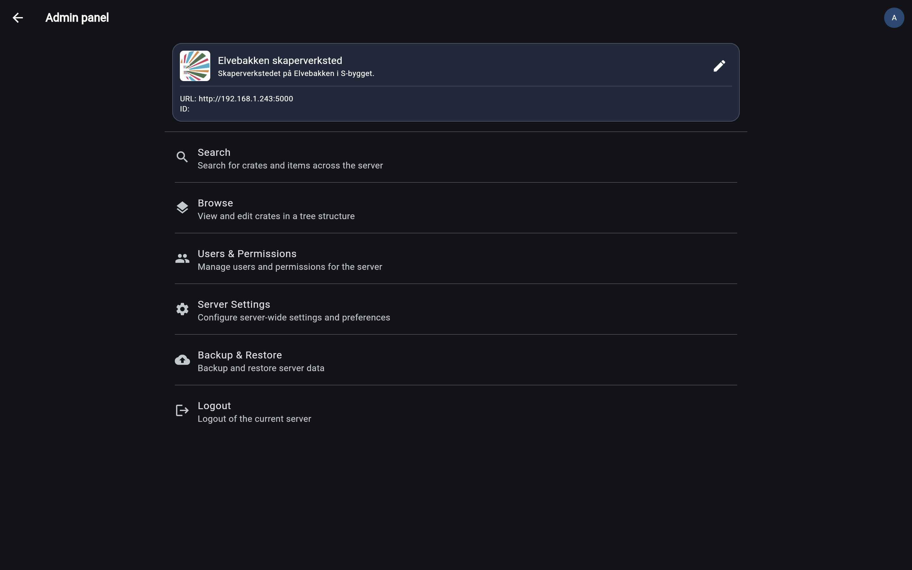

# Editing
After having connected to the server you can start editing your inventory. To get there we will start by opening the admin-panel.

## Opening the admin-panel
Inside the search page, click the three dots in the top right corner to open the dropdown.

From the dropdown, select "Edit".

Enter you admin credentials and click "Login". If you have not set up an admin user yet, one should have been created automaticly, see the [Server setup](../getting_started/server_setup.md) guide.

## The admin-panel
The admin-panel is where you can edit all aspects of your server. For now we will focus editing your inventory.

Click the "Browse" button to open an file explorer-like view of your inventory.

## The browse view
Skapersøk is a hirarchical inventory system, meaning that your inventory is structured in a tree-like structure.

The browse view allows you to navigate through this structure and edit your inventory.

Lets get a little more familiar with the browse view.

Centered on the top is a section with information about our current location in the inventory. The location is represented as a path, similar to how file paths are represented on your computer.

Here is an example of the browse view when we have navigated deeper into the inventory. The path section now shows us that we are currently inside a crate called "Micro kontrollere & misc", which is inside another crate called "Arbeidsbenk".

The other important part of the browse view is the list of items. This is where you can see all the items that are in your current location in the inventory. Meaning all items in your currently selected crate.

For example, in the above image we can see that there are four crates at the top of our tree (the root): "Arbeidsbenk", "Skap", "Komponenter" and "Skråvegg".

## Creating a new crate
Anyways, lets get back to editing. To create a new crate, click the "New crate" button in the bottom right corner.

NOT FINISHED

## Editing an existing crate
To edit an existing crate, click the three dots on the right side of the crate you want to edit. This will open a dropdown with options for that crate.

Select "Edit" from the dropdown to open the edit form for that crate. On mobile this will open a bottom sheet with the edit form, while on desktop it will open a modal window with the edit form.

Now you can edit the name, placementcode, description and lots of other properties of the crate. When you are done, click "Save" to save your changes.

